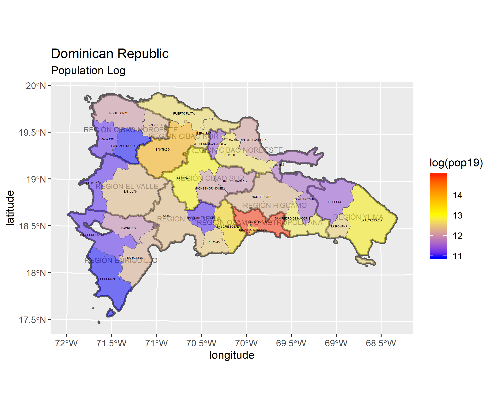

# Dominican Republic

Below is my final project on the Dominican Republic.

## Political Subdivisions

### Administrative Subdivisions

This map shows the regions and provinces of the Dominican Republic as a whole. The country is bordered on the west by Haiti, with the Atlantic Ocean to the north and east and the Caribbean Sea to the south.

Pictured are the boundaries and districts of La Romana and Villa Hermosa provinces, which I decided to focus on. There are very few districts present in the region, making the entire province of Villa Hermosa appear as part of a city. The region is located along the southern coast, and an island is present at the bottom of the map.

## Population

### Population of the Dominican Republic's Regions

Outside of the Santo Domingo region, which contains approximately 3/8 of the country's population, people are concentrated in tourist regions along the coast. One thing to note is the low population in the western provinces bordering Haiti; this is likely a result of poverty and reduced infrastructure.

### Population Log of the Dominican Republic's Provinces

Population has very large concentration in Santo Domingo; nowhere else in the country is the population log even close.

### Density Histogram

The apparent negative correlation between population and density in this histogram reveals that density is very high in Santo Domingo and quite low everywhere else, even in other urban areas.

### Correlation

This plot reveals a heavy correlation between population and nighttime lights within the Dominican Republic as a whole. One explanation for the result is the country's large urban population, as more people in cities will produce a greater positive correlation with lighting.

This plot illustrates the fitted values of each available variable against the residual data of the regression model. The high r-squared value suggests strong correlation between population and the variables.

### Differences
#### Sums Differences

These two plots suggest that the largest differences between the predicted output and population sums occur in the cities. Negative values exist in the largest urban areas because population models tend to overestimate the populations of cities. My population sums model was the most accurate of the three, having the smallest margin of error.

#### Means Differences

These two plots appear similar to the sums differences plots above, as means are also overestimated in the cities. In fact, the gap between Santo Domingo and the rest of the country is even more exaggerated here than for sums differences.

#### Logpop Differences

The logpop differences are similar to the aforementioned differences because the inner cities have the largest overestimations. However, for the population log, the suburbs of urban areas are much more positive than in the other difference plots, suggesting that the logarithm tends to underestimate these areas.

## Roads and Health Care
### Transportation in La Romana & Villa Hermosa

The roadways in the two provinces are largely focused on the major city of La Romana, with a moderate correlation between number of roads and population density. There appears to be one road that bypasses the city and connects to the second largest city in the region, while it continues to traverse the southern coast of the island. Another road branches off from the main city and travels north further into the country. Overall, most roads are built with the purpose of connecting settlements.

**Total Roads: 3042**  
**Total Roads on Map: 261**  
**Primary Roads: 46**  
**Secondary Roads: 65**  
**Tertiary Roads: 112**  
**Motorways: 38**  

### Healthcare in La Romana & Villa Hermosa

Healthcare facilities proved to be few and far between in La Romana and Villa Hermosa. Only 11 health centers were present in the region; all of them were classified as hospitals and all of them were located within the limits of the largest city. Therefore, access to health care may be unreliable for people living in the second largest city and other, more rural areas of these two provinces. The map reveals that government is not investing enough money into healthcare in these two provinces.

**Total Healthcare Facilities: 11**  
**Hospitals: 11**

### Combined with Topography

Based on the topographic map, there is little correlation between topography and population. Since the region is coastal, very few mountains are present. Furthermore, the few hills and valleys that do exist have virtually no roads passing through and no access to healthcare, which is completely limited to cities.
