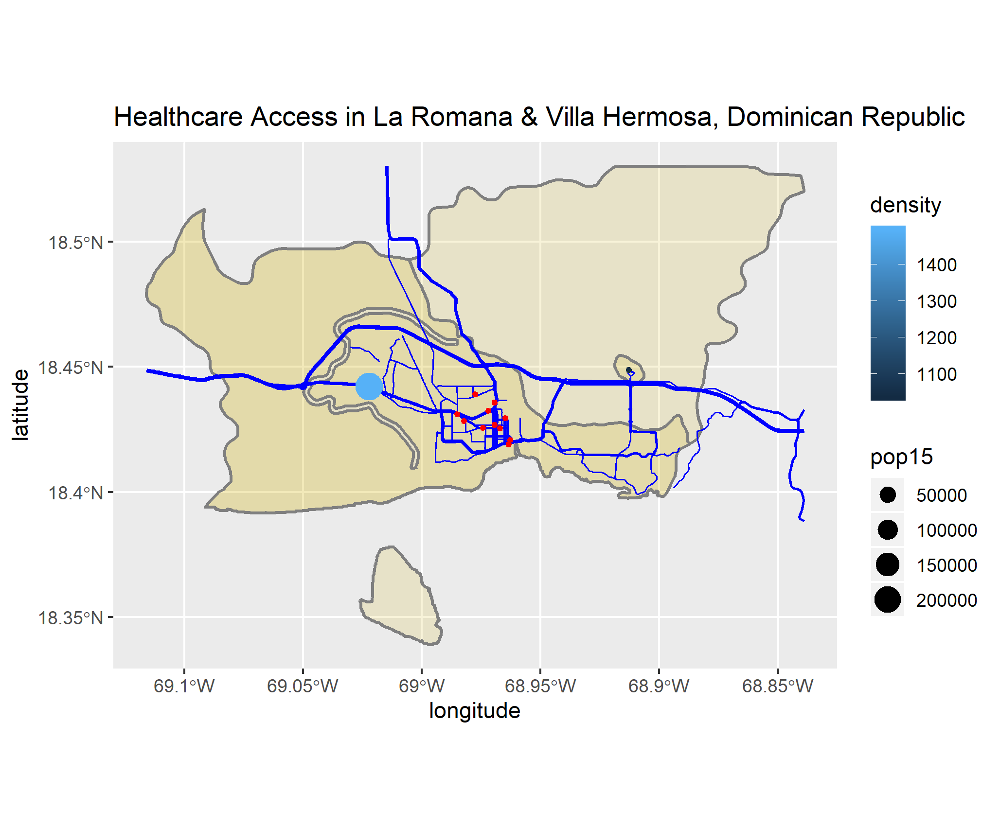

# Dominican Republic

Below is my final project on the Dominican Republic.

## Political Subdivisions

### Administrative Subdivisions

This map shows the regions and provinces of the Dominican Republic as a whole.

Pictured are the boundaries and districts of La Romana and Villa Hermosa provinces, which I decided to focus on. There are very few districts present in the region, making the entire province of Villa Hermosa appear as part of a city. The region is located along the southern coast, and an island is present at the bottom of the map.

## Population

### Population of the Dominican Republic's Regions

### Population Log of the Dominican Republic's Provinces

### Density Histogram

### Correlation

This plot reveals a heavy correlation between population and nighttime lights within the Dominican Republic as a whole. One explanation for the result is the country's large urban population, as more people in cities will produce a greater positive correlation with lighting.

This plot illustrates the fitted values of each available variable against the residual data of the regression model. The high r-squared value suggests strong correlation between population and the variables.

### Differences
#### Sums Differences

These two plots suggest that the largest differences between the predicted output and population sums occur in the cities. Negative values exist in the largest urban areas because population models tend to overestimate the populations of cities.

#### Means Differences

These two plots appear similar to the sums differences plots above, as means are also overestimated in the cities. In fact, the gap between Santo Domingo and the rest of the country is even more exaggerated here than for sums differences.

#### Logpop Differences

The logpop differences are similar to the aforementioned differences because the inner cities have the largest overestimations. However, for the population log, the suburbs of urban areas are much more positive than in the other difference plots, suggesting that the logarithm tends to underestimate these areas.

## Roads and Health Care
### Transportation in La Romana & Villa Hermosa

### Healthcare in La Romana & Villa Hermosa

